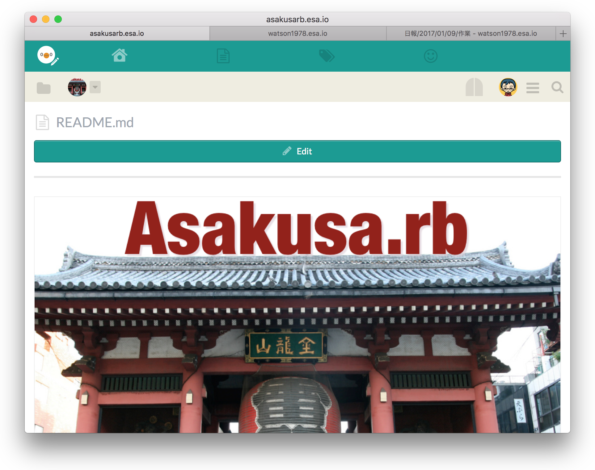

# kotori (小鳥)

A OS X client app for [esa.io](https://esa.io/)

## Downloading

You can download this app from [releases page](https://github.com/Watson1978/kotori/releases)

## Contributing

This app is written by RubyMotion and you will require it. 

1. Fork it ( https://github.com/[my-github-username]/foo/fork )
2. Create your feature branch (`git checkout -b my-new-feature`)
3. Commit your changes (`git commit -am 'Add some feature'`)
4. Push to the branch (`git push origin my-new-feature`)
5. Create a new Pull Request
